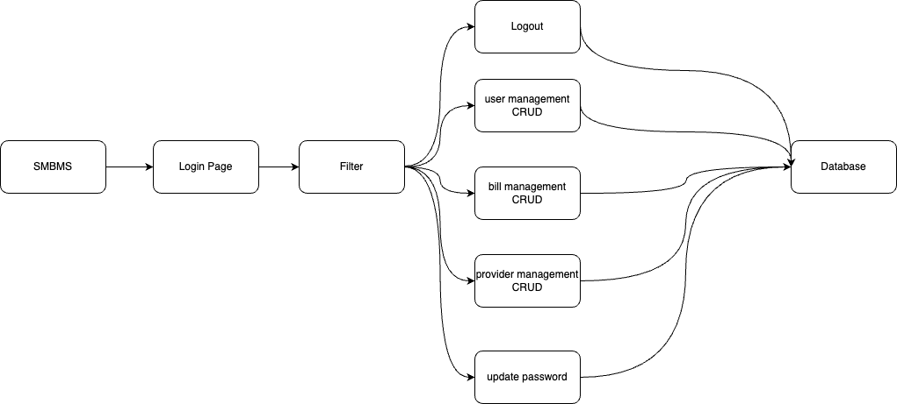
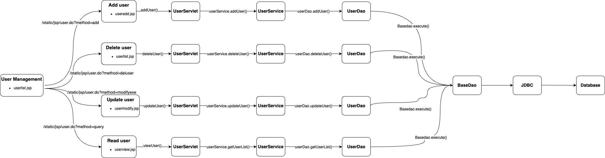
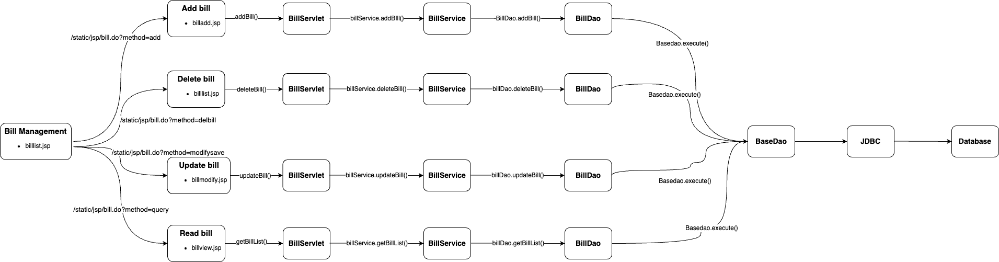
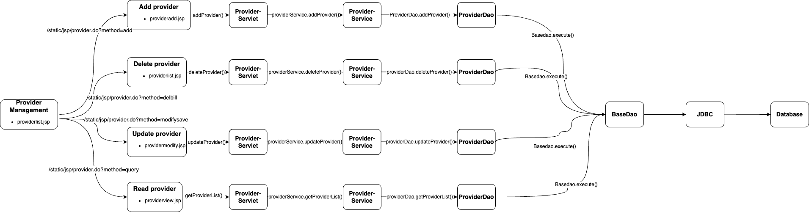

# SuperMarket Bill Management System (SMBMS)

## Project Description
This SMBMS is a web project developed by Java. It is designed for a supermarket to manage its bill data within a system. 

There are five main functions achieved by this Java web project:
- <b>Login and logout functions:</b> The web allows user to login and logout to the system
- <b>User management function:</b> The user could add, delete, update, lookup (CRUD) user information
- <b>Bill management function:</b> The user could add, delete, update, lookup (CRUD) bill information
- <b>Provider management function:</b> The user could add, delete, update, lookup (CRUD) provider information
- <b>Update password:</b> The user could update its password

## Development tool
- Intellij IDEA 2023.1.3
- MySQL Workbench 8.0
- Tomcat 10.1.9

## Dependencies in pom.xml
- jakarta.servlet-api
- mysql-connector-j
- jstl-api
- taglibs-standard-impl
- junit

## Project Structure
- <b>Whole structure
  
- user management
  
- bill management
  
- provider management </b>
  